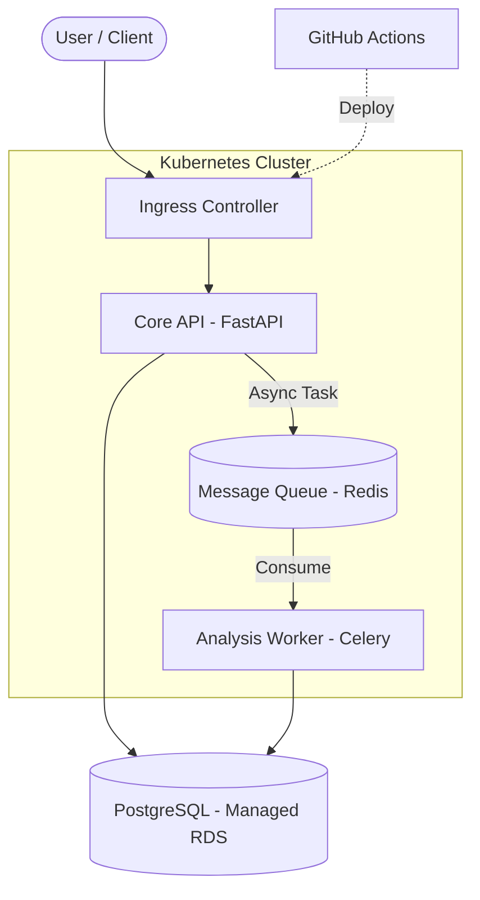

# 💰 RupeePlan: FinOps Core

**RupeePlan** is a high-performance, cloud-native FinOps platform designed to track, categorize, and analyze financial data with surgical precision. It separates heavy data ingestion from compute-intensive analysis using a microservices architecture.

---

## 🏗️ System Architecture

RupeePlan is built with a **Kubernetes-first** approach, ensuring portability across AWS (EKS) and Azure (AKS).



## 🛠️ Technology Stack

| Domain | Technology | Rationale |
| --- | --- | --- |
| **Backend** | Python 3.11+, FastAPI | High performance, async support, and strong typing. |
| **ORM** | SQLAlchemy 2.0 | Advanced mapping and async database connectivity. |
| **Database** | PostgreSQL | ACID compliance for financial integrity. |
| **Infra** | Terraform, Kubernetes | Declarative, cloud-agnostic infrastructure. |
| **CI/CD** | GitHub Actions | Automated security gating and deployment. |

## 🚀 Key Features

- **Asynchronous Ingestion:** CSV bank statement processing that doesn't block the UI.
- **Strict Data Integrity:** Uses `Numeric(12, 2)` for financial accuracy—no floating-point errors.
- **Smart Categorization:** Extensible worker engine for auto-labeling transactions.
- **Security-First:** UUID-based primary keys and strict CI/CD security gating (Trivy, tfsec).

## 📖 Learnings & Interview Prep

This repository is designed as a learning journey. For every milestone reached, we document the theoretical "Why" in our [Learnings Directory](./learnings/README.md).

- **[Issue #1: Project Scaffolding](./learnings/issue-1-initialization.md)**
- **[Issue #2: Data Modeling](./learnings/issue-2-models.md)**

## 💻 Local Development

1. **Clone the Repo:**
   ```bash
   git clone https://github.com/abhisheksinghautomotive/RupeePlan.git
   ```
2. **Environment Setup:**
   ```bash
   cp .env.example .env
   # Update variables in .env
   ```
3. **Run with Docker (Coming Soon):**
   ```bash
   docker-compose up --build
   ```

## 📜 Development Workflow

We follow **Trunk-Based Development**. All features and fixes are merged via Pull Requests after passing automated security and quality gates.

---
*Built with ❤️ by Abhishek Singh*
