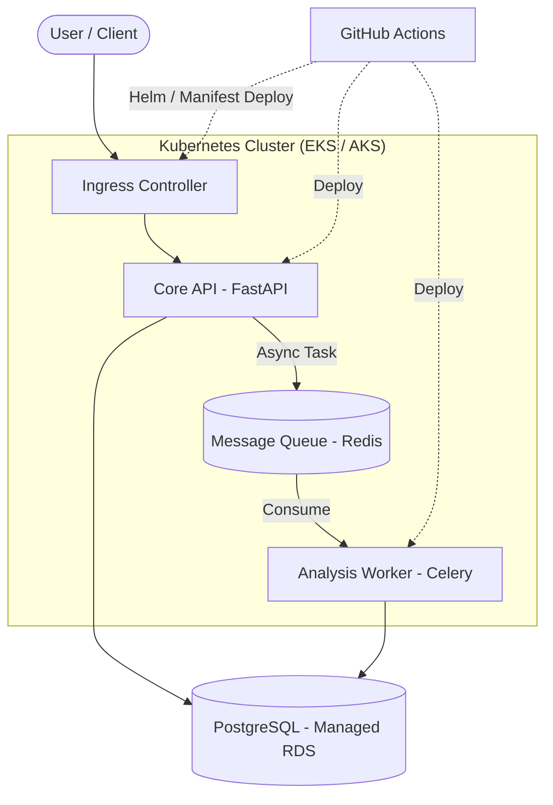

# Project Charter & Architecture: FinOps Core
**Prepared For:** Automation Lead / Cloud DevOps Candidate
**Status:** Final Draft - Approved for Execution

## 1. Executive Summary
This document outlines the architectural blueprint and execution roadmap for **FinOps Core**, a cloud-native, microservices-based personal finance tracker and budget analysis engine. The project strictly separates ingestion (I/O bound) from analysis (Compute bound) and implements infrastructure via Code (Terraform) mapped to automated CI/CD pipelines (GitHub Actions).

## 2. System Architecture
The architecture leverages a Kubernetes-first strategy to ensure workload portability across cloud providers (AWS EKS or Azure AKS). It implements a decoupled microservices pattern utilizing asynchronous message passing.



### Component Breakdown

* **Core API (FastAPI):** Handles synchronous requests (CSV uploads, fetching dashboards). Validates input and delegates heavy processing.
* **Analysis Worker (Celery):** Background process reading raw transactions, applying ML/Regex categorization, and updating Budget states.
* **Message Queue (Redis):** Broker between API and Worker, preventing API blocking.
* **Database (PostgreSQL):** Strict relational schema maintaining ACID compliance.

## 3. Technology Stack & Tooling

| Domain | Primary Tool | Justification |
| --- | --- | --- |
| **Application Backend** | Python, FastAPI, SQLAlchemy | High-performance, async-native, strong typing. |
| **Database Layer** | PostgreSQL 15+ | Relational data integrity is non-negotiable. |
| **Infrastructure as Code** | Terraform | Cloud-agnostic state management. |
| **Container Orchestration** | Kubernetes | Industry standard for high-availability. |
| **CI/CD Pipeline** | GitHub Actions & Helm | Automated testing, security gating, deployments. |

## 4. Data Architecture (Core Models)

```python
# SQLAlchemy ORM Representation (Core Models)

class User(Base):
    __tablename__ = 'users'
    id = Column(UUID, primary_key=True)
    email = Column(String, unique=True, index=True)
    password_hash = Column(String)

class Account(Base):
    __tablename__ = 'accounts'
    id = Column(UUID, primary_key=True)
    user_id = Column(UUID, ForeignKey('users.id'))
    institution = Column(String)
    balance = Column(Numeric(12, 2))

class Transaction(Base):
    __tablename__ = 'transactions'
    id = Column(UUID, primary_key=True)
    account_id = Column(UUID, ForeignKey('accounts.id'))
    category_id = Column(UUID, ForeignKey('categories.id'), nullable=True)
    amount = Column(Numeric(12, 2))
    description = Column(Text)
    is_analyzed = Column(Boolean, default=False)

```

## 5. Execution Roadmap (Milestones)

* **Milestone 1: Data Architecture & Local Core**
Establish the foundation by writing SQLAlchemy models, developing the CSV parsing engine, and creating a local `docker-compose` environment.
* **Milestone 2: Infrastructure Skeleton (Terraform)**
Write declarative Terraform modules to provision the underlying Cloud VPC, Networking, and a cost-optimized K8s control plane.
* **Milestone 3: Kubernetes Orchestration & Helm**
Transition to K8s manifests. Package deployments, services, ingress, and secrets into a Helm Chart.
* **Milestone 4: CI/CD Pipeline (GitHub Actions)**
Establish automated deployment pipeline with OIDC, incorporating strict SAST, Dependency, Container, and IaC security gating (Trivy, tfsec, Bandit).
* **Milestone 5: Analysis Engine & Observability**
Activate Celery worker for async processing. Deploy Prometheus & Grafana to monitor system health.
